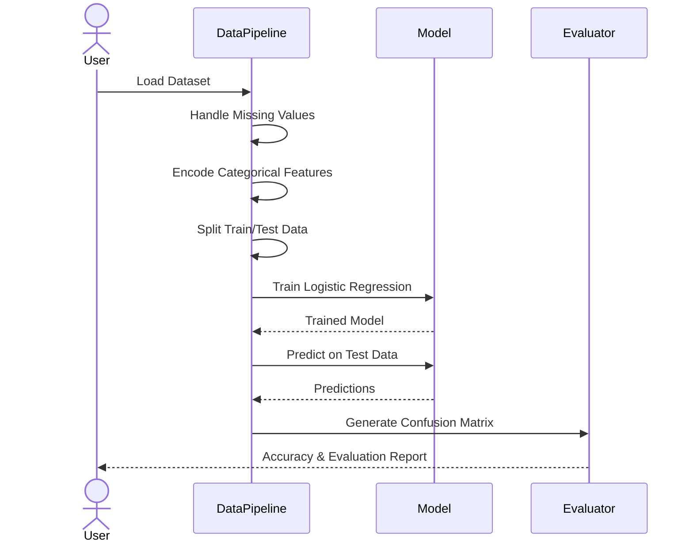

```mermaid
sequenceDiagram
    actor User
    participant DataPipeline
    participant Model
    participant Evaluator

    User->>DataPipeline: Load Dataset
    DataPipeline->>DataPipeline: Handle Missing Values
    DataPipeline->>DataPipeline: Encode Categorical Features
    DataPipeline->>DataPipeline: Split Train/Test Data

    DataPipeline->>Model: Train Logistic Regression
    Model-->>DataPipeline: Trained Model

    DataPipeline->>Model: Predict on Test Data
    Model-->>DataPipeline: Predictions

    DataPipeline->>Evaluator: Generate Confusion Matrix
    Evaluator-->>User: Accuracy & Evaluation Report
```